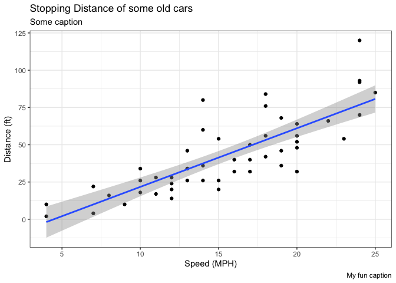

# Class 5: Data Visualization with ggplot
Barry (PID: 911)

## Using GGPLOT

To use ggplot2 we first need to install it on our computers. To do this
we will use the function `install.packages()`.

Before I use any package functions I have to load them up with a
`library()` call, like so:

``` r
library(ggplot2)
ggplot(cars)
```


``` r
head(cars)
```

There is always the “base R” graphics system, i.e. `plot()`

``` r
plot(cars)
```


To use ggplot I need to spell out at least 3 things: - data (the stuff I
want to plot as a data.frame) - aesthetics (aes() values - how the data
map to the plot). - geoms (how I want things drawn)

``` r
ggplot(cars) +
  aes(x=speed, y=dist) +
  geom_point() +
  geom_smooth(method="lm")
```

    `geom_smooth()` using formula = 'y ~ x'


``` r
ggplot(cars) + 
  aes(x=speed, y=dist) +
  geom_point() + 
  geom_smooth(method="lm")
```

    `geom_smooth()` using formula = 'y ~ x'


## Section 6

Adding more layers to a scatter plot

``` r
ggplot(cars) + 
  aes(x=speed, y=dist) +
  geom_point() + 
  geom_smooth(method="lm") +
  labs(title = "Stopping Distance of some old cars",
       subtitle = "Some caption",
       x="Speed (MPH)",
       y="Distance (ft)",
       caption = "My fun caption") + 
  theme_bw()
```

    `geom_smooth()` using formula = 'y ~ x'



## Expression data example

``` r
url <- "https://bioboot.github.io/bimm143_S20/class-material/up_down_expression.txt"
genes <- read.delim(url)
head(genes)
```

            Gene Condition1 Condition2      State
    1      A4GNT -3.6808610 -3.4401355 unchanging
    2       AAAS  4.5479580  4.3864126 unchanging
    3      AASDH  3.7190695  3.4787276 unchanging
    4       AATF  5.0784720  5.0151916 unchanging
    5       AATK  0.4711421  0.5598642 unchanging
    6 AB015752.4 -3.6808610 -3.5921390 unchanging

Q. How many genes are there?

``` r
nrow(genes)
```

    [1] 5196

There are 5196 in this silly dataset.

Q. How many are “up”

``` r
sum(genes$State == "up")
```

    [1] 127

There are 127 “UP” regulated genes in this dataset.
